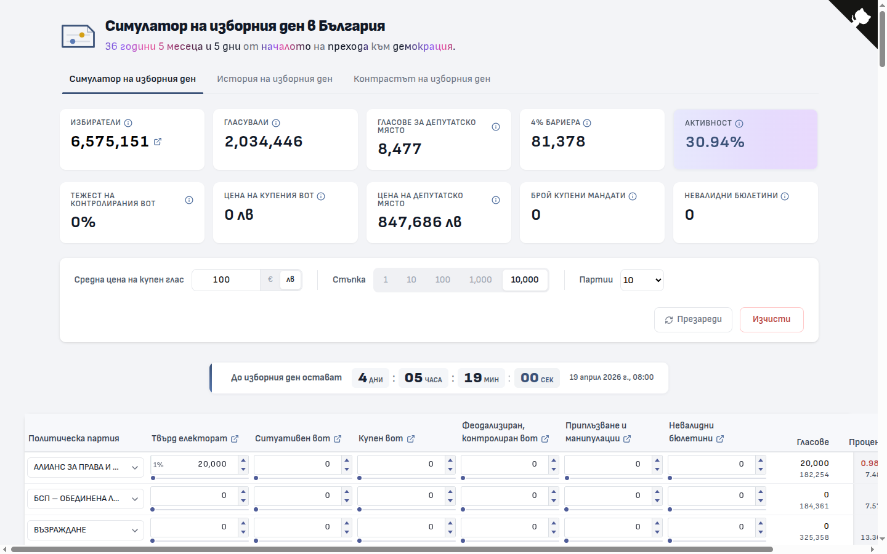

# Симулатор на изборния ден

„Симулатор на изборния ден" е интерактивно уеб приложение, което моделира как различните видове гласове — твърд електорат, купен вот, контролиран вот, феодален вот и други — влияят върху разпределението на мандатите в българския парламент.



## Използвани технологии

Проектът е базиран на Angular, ECharts, Tailwind CSS, TypeScript.

## Инсталация

```bash
npm install
npm start
```

## Къде са данните

Всички данни се намират в директорията **[`public/data/`](public/data/)** като JSON файлове. Те се зареждат динамично по време на изпълнение на приложението.
